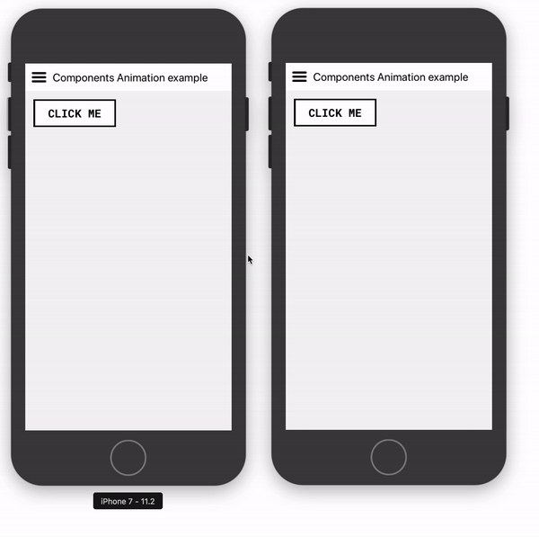
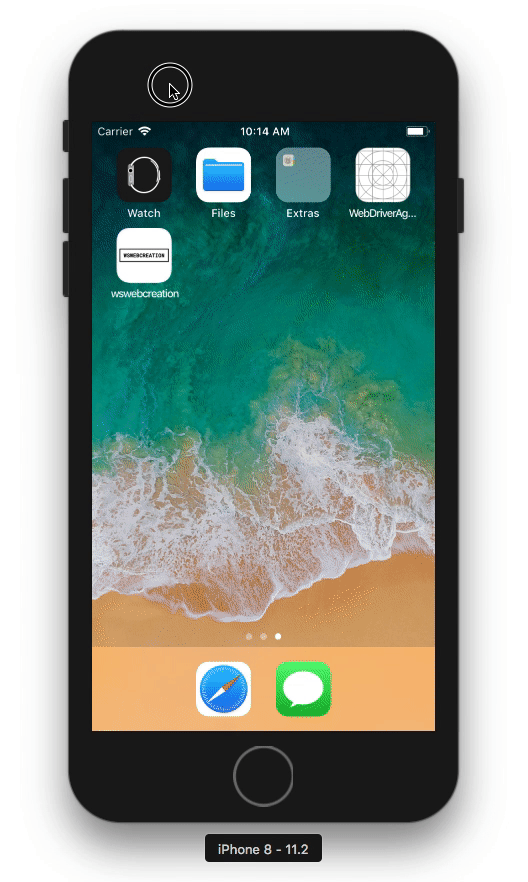
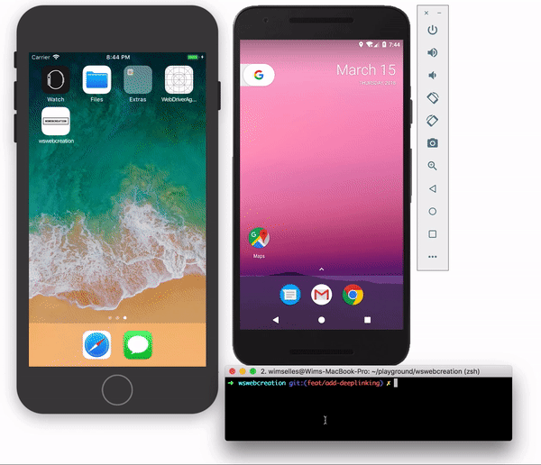
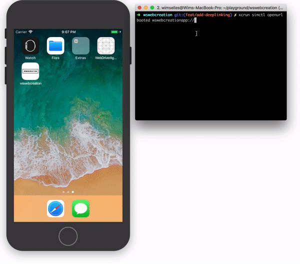

# wswebcreation-react-native-app

[](https://gitter.im/wswebcreation/Lobby)

An app which is build with React Native and will be used for test (automation) purposes.


 

## About
As mentioned above I want to use this app to explore the possibilities for testing a (React) Native app (iOS / Android).
In order to understand what I need to test I told myself that I needed to be able to build a React Native app, so here it is :-) 
This app has three tabs that all do something different. More info will follow in the coming months. You can also follow my progress on my [site / blog](http://www.wswebcreation.nl/)

### Home
This is the intro of the app

### Webview
In the Webview you can enter an URL and load it in the Webview

### Chats
In the chats I created multiple API calls to retrieve JSON data from [GitHubGist](https://gist.github.com/wswebcreation). 
When you select a chat you will get a chatbox. Here you can add chats and you will get a response (some movie onliners) from my gist.

## Install
This will only work on a MAC so get started execute the following steps:

1. Clone the project: `git clone https://github.com/wswebcreation/wswebcreation-react-native-app.git`
2. Go to the folder: `cd wswebcreation-react-native-app`
3. Install all (dev)dependencies: `npm install`
4. Start the project for iOS `npm run ios`, for Android run `npm run android`
5. Happy playing!

## Different environment builds
This project already supports different environment builds. This means that

- specific configurations can be save into different environment files, see in the root of the project the `.env` and `.env.{environment}`-files
- different builds can be created with running for example the command `npm start ios.automation` or `npm start android.automation`

They advantage of this will be that config variables can be exposed to the JS code in React Native in an easy way.

> Currently only the `BASE_URL` and the `ENVIRONMENT` variables are saved and used from the `.env`-files, but in the future this can be more.  

## Disable Animations
Because of the different environments we can also pinpoint which type of build we have. For for example the automation build we want to limit the amount of animations.
Animations can be a killer for waits and can increase the execution time of tests. With some small changes in the code there is a possibility to create a specific automation build without animations.

In most cases all libraries use the `Animated`-component of React Native to animate stuff. [`timing`](https://facebook.github.io/react-native/docs/animated.html#timing) or [`spring`](https://facebook.github.io/react-native/docs/animated.html#spring) are used to add the durations and so on.
These methods can easily be stubbed which you will find below (with some help of my friend and colleague [Lucas Bento](https://github.com/lucasbento))

### Implementation
See the [`index.js`](./index.js) file in the root of the project. There you will see two extra lines of code

```js
import { setupAutomation } from './app/config/TestProperties';

setupAutomation();
```

They need to be added and executed at the highest level of the app, to be able to stub all the animations, and refer to the [`TestProperties.js`](./app/config/TestProperties.js). 
Together with a stub library called `stubs` we can stub almost all animations that come from the `Animation`-component from React Native. 

This will give a build like below. On the left iPhone you see the normal build, on the right the automation build with no animation when the chat is loaded on the card

> *In my testapp I use [react-navigation](https://github.com/react-navigation/react-navigation). You can do all nice things with animations and custom animations. In my app I've chosen to use the default animation which was "harder" to stub, but with a dirty little hack you understand and see the difference ;-).* 


Or with an animated component that I've created for this topic see below



## Storybook
This project also has storybook implemented, for more info about storybook please check [here](https://github.com/storybooks/storybook/tree/master/app/react-native).

The basic idea behind storybook is that you can develop individual React Native components without running your app. But it can also be used to individually (automatically) test React Native components in the app. See also [Deep Linking](./README.md#deep-linking) for more info.

To manually start storybook in this app execute the following steps:

1. Run `npm run storybook`
2. Build the app with for example `npm run ios` or `npm run android`.

You can then walk through the components like below.



## Deep Linking
Deeplinking has been implemented in this app through `react-navigation`, see [here](https://reactnavigation.org/docs/deep-linking.html) for more info.
With deeplinking we can now easily directly go to specific screens or screens that are only available in a specific build. 

### Example: storybook
For testing specific components in the app I've implemented storybook, see [here](./README.md#storybook). Storybook is only available on a `dev` or `automation`-build, see [Different environment builds](./README.md#different-environment-builds). Run your build and then run it with one of the following commands

```bash
# For iOS use
xcrun simctl openurl booted wswebcreationapp://storybook

# For Android use
adb shell am start -W -a android.intent.action.VIEW -d "wswebcreationapp://wswebcreationapp/storybook" com.wswebcreation
```

You are now able to access storybook as shown below.



### Example: Chatbox shortcut
In production it could also be that you receive a link to open for example a chat directly. In the gif below you will see how that works in my demo app. Here we start the app with a deeplink to open the chatbox of one of our friends with `xcrun simctl openurl booted wswebcreationapp://chatbox/name`


> **I've mocked the data retrieved in the [`ChatBox.js`](./app/screens/ChatBox.js) for demo purpose. You can add whatever name you want, you will always retrieve Dick Tracy ;-), but I hope you understand how it works and how it can benefit you during testing.**



## Testing

### Appium
>**Make sure you've installed Appium on your local machine. There are a lot of good articles on the web the help you with that. You can start with the [Appium Docs](http://appium.io/docs/en/about-appium/getting-started/)**

>**Don't forget to set all the environment variables for Android, see [here](https://stackoverflow.com/questions/19986214/setting-android-home-enviromental-variable-on-mac-os-x) or Google it ;-)**

#### Android and ChromeDriver
When accessing a webview on Android it could be that you get this error

    An unknown server-side error occurred while processing the command.
    Original error: unknown error: Chrome version must be >= 55.0.2883.0

You can fix this by checking the [docs](https://appium.io/docs/en/writing-running-appium/web/chromedriver/) on Appium by downgrading ChromeDriver during install. The right version can be found [here](https://chromedriver.storage.googleapis.com/2.35/notes.txt). 
 
> **Change the number of ChromeDriver tot the latest version to see an overview of all versions**

#### Appium Config
In this setup I use:

- [webdriver.io](http://webdriver.io/) => the testframework
- [CucumberJS](https://github.com/cucumber/cucumber-js) => the language in / way I write tests
- [multiple-cucumber-html-reporter](https://github.com/wswebcreation/multiple-cucumber-html-reporter) => some nice cucumber reporting
- [Appium Desktop](https://github.com/appium/appium-desktop) => for debugging the app / finding the elements if needed

The config can be found in [__tests__/appium/config](./__tests__/appium/config).

The tests can be found in [__tests__/appium/features](./__tests__/appium/features).

> Run tests with `npm run appium.ios`. In this case the app will be closed and started between all scenario's.


> Run tests with `npm run appium.ios -- --restartDot`. In this case the app will internally be started between all scenario's, this reduce the execution time a little bit. (total time went from 128 seconds to 107 seconds).
Large test sets will have even more profit.


### Detox
#### Installing Detox
Walk through step 1 listed [here](https://github.com/wix/detox/blob/master/docs/Introduction.GettingStarted.md)

The rest of the dependencies will be downloaded when you do a `npm install` for this repo.

#### Detox config and tests
- The detox config can be found in [__tests__/detox/config/](./__tests__/detox/config)-folder
- The detox tests can be found in [__tests__/detox/features/](./__tests__/detox/features)-folder

#### Running tests
- Before running the detox tests please run `npm run detox.build`. This will build an app that can be used for testing
- To run the tests on iOS run `npm run detox.ios`
- Android tests are in the [TODO](./README.md#todo) list.


## TODO
- [x] Create an iOS app
- [x] Add an APP icon
- [x] Create an Android app
- [x] Refactor code
- [x] Refactor `ChatBox.js` code
- [x] Add test properties (`testID` for iOS and `accessibilityLabel` for Android) 
- [x] Add Appium setup
- [x] Add Appium tests for navigation
- [x] Add Appium tests for webview screen
- [x] Add Appium tests for chat screen 
- [x] Add Detox setup iOS
- [x] Add Detox tests for navigation iOS
- [x] Add Detox tests for webview screen iOS
- [x] Add Detox tests for chat screen iOS
- [ ] Add Detox setup Android
- [ ] Add Detox tests for navigation Android
- [ ] Add Detox tests for webview screen Android
- [ ] Add Detox tests for chat screen Android
- [x] Implement different environments / build types
- [x] Add storybook
- [x] Add deeplink
- [x] Disable animations for automation
- [ ] Add mocking for the API's
- [ ] Add UT's with Jest and Enzyme

## Issues
- [ ] Check issue in Tabnavigator with `tabBarTestIDProps`, it's not working for Android, got a workaround for it
- [x] ~Check how to "slow down" swiping on Android, looks like it is taking 2 screens at the same time~ => *Fixed: It were the `x.start` and `x.end` coordinates that were to big which caused to scroll 2 screens. Can be checked by hand.*
- [ ] Fix issue Android stackmenu and chatbox scroll to much up

## Contributing
If you'd like to contribute feel free to create a PR. If you have some code feedback you may also add a PR or contact me through [Gitter](https://gitter.im/wswebcreation)

## Credits
- I'd like to thank [yllongboy](https://medium.com/@yllongboy) for his clear article about creating a "WhatsApp Layout through React Native".
- I'd also like to thank [randomuser.me](https://randomuser.me/) for generating random users with avatars.
